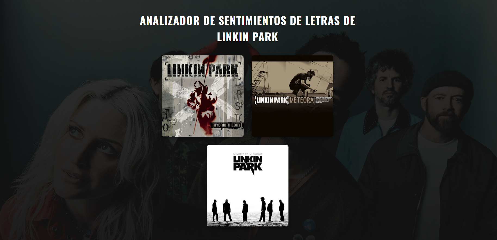

# Analizador de Sentimientos de Letras de Linkin Park

 <!-- Reemplaza con una captura de pantalla real -->

Una aplicación web full-stack que permite a los usuarios explorar la discografía de Linkin Park y analizar la carga emocional de las letras de sus canciones, visualizando los resultados de manera gráfica.

**[➡️ Ver Demo en Vivo](https://TU-LINK-DE-VERCEL.app)** <!-- Actualizarás esto al final -->

---

## ✨ Características

*   **Interfaz Interactiva:** Explora los álbumes y canciones de Linkin Park.
*   **Análisis de Sentimientos en Tiempo Real:** Haz clic en una canción para analizar su letra al instante.
*   **Visualización de Datos:** Un gráfico de dona muestra la distribución de sentimientos (positivo, negativo, neutral).
*   **API RESTful en Backend:** El frontend consume datos de una API construida con Flask.
*   **Diseño Responsivo:** Funciona bien en diferentes tamaños de pantalla.

---

## 🚀 Stack Tecnológico

*   **Frontend:** React, Axios, Chart.js
*   **Backend:** Python, Flask, NLTK (VADER)
*   **Base de Datos:** Un archivo `JSON` estático como fuente de datos.

---

## local_development Cómo Ejecutar Localmente

Sigue estos pasos para levantar el proyecto en tu máquina.

### Prerrequisitos

*   Python 3.x
*   Node.js y npm
*   Git

### Instalación

1.  **Clona el repositorio:**
    ```bash
    git clone https://github.com/TU_USUARIO/linkin-park-analyzer.git
    cd linkin-park-analyzer
    ```

2.  **Configura el Backend:**
    ```bash
    cd backend
    python -m venv venv
    # En Windows: venv\Scripts\activate
    # En Mac/Linux: source venv/bin/activate
    pip install -r requirements.txt # Crearemos este archivo pronto
    flask run
    ```
    El backend estará corriendo en `http://127.0.0.1:5000`.

3.  **Configura el Frontend (en otra terminal):**
    ```bash
    cd frontend
    npm install
    npm start
    ```
    La aplicación se abrirá en `http://localhost:3000`.